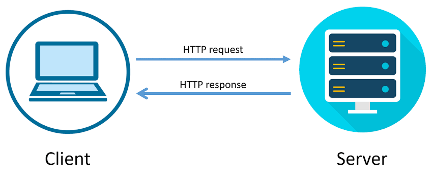
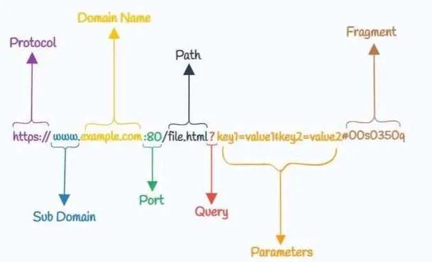
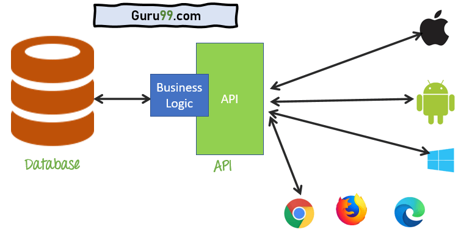

## Basic Concepts of Networking

Networking is the practice of connecting computers and devices to share resources and communicate with each other.

### Introduction to Networking

Networking enables devices to communicate, share resources, and access information, crucial for internet browsing, file sharing, and communication.

### What is a Protocol?

A protocol is a set of rules that governs how data is transmitted and received between devices, ensuring effective communication.

### What is HTTP?

HTTP is the protocol used for communication on the World Wide Web, defining how messages are formatted and transmitted.

### HTTP Requests and Responses

HTTP requests are messages sent by clients to servers, requesting specific actions (e.g., retrieving a webpage). Responses are messages sent by servers back to clients, containing the requested information.

### What is a Client? What is a Server?

A client is a device or program that initiates communication by sending requests to a server. A server is a device or program that responds to client requests by providing resources or services.

### Internet Protocol (IP) Address

An IP address is a unique identifier assigned to each device connected to a network, enabling communication over the internet or a local network.

### What is a Port?

A port is a communication endpoint that enables a device to differentiate between multiple services or processes running on the same IP address, specifying which application or service to communicate with.

## URL Decomposition

A URL (Uniform Resource Locator) is a web address that specifies the location of a resource on the internet. It consists of several components:

- **Protocol**: Indicates the protocol used to access the resource (e.g., `http://`, `https://`).
- **Domain**: Specifies the domain name or IP address of the server hosting the resource.
- **Port**: (Optional) Specifies the port number to use for the connection.
- **Path**: Specifies the path to the resource on the server.
- **Query**: (Optional) Contains additional parameters for the resource.
- **Fragment**: (Optional) Specifies a specific section within the resource.

### DNS (Domain Name System)

The Domain Name System (DNS) is a decentralized naming system for computers, services, or other resources connected to the internet. It translates domain names (e.g., `example.com`) into IP addresses (e.g., `192.168.1.1`) that computers can understand. DNS operates on UDP port 53.

### HTTP Request and Response

HTTP (Hypertext Transfer Protocol) is the protocol used for communication on the World Wide Web. It defines how messages are formatted and transmitted between clients and servers.

#### HTTP Methods:

- **GET**: Requests data from a server.
- **POST**: Submits data to be processed by a server.
- **PUT**: Updates an existing resource on the server.
- **DELETE**: Deletes a resource on the server.
- **PATCH**: Partially updates a resource on the server.
- **HEAD**: Requests metadata from a server without requesting the actual resource.
- **OPTIONS**: Requests information about the communication options available for a resource.

### JSON (JavaScript Object Notation)

JSON is a lightweight data interchange format that is easy for humans to read and write and easy for machines to parse and generate. It is widely used for transmitting data between a server and a web application.

### API (Application Programming Interface)

An API is a set of rules and protocols that allows one software application to interact with another. It defines the methods and data formats that applications can use to request and exchange information.

#### Advantages and Features of an API

1. **Interoperability**: APIs allow different software systems to communicate and share data with each other, enabling interoperability between diverse applications and platforms.

2. **Modularity**: APIs promote modularity by breaking down complex systems into smaller, more manageable components. This modular approach makes software development more flexible and scalable.

3. **Reusability**: APIs promote code reuse by providing a standardized way to access functionality. Developers can leverage existing APIs to add new features or integrate with other systems without reinventing the wheel.

4. **Scalability**: APIs allow applications to scale more easily by offloading certain tasks or services to external APIs. This helps improve performance and efficiency.

5. **Security**: APIs can enforce security measures, such as authentication and authorization, to protect sensitive data and resources. They also allow for secure data and resources to be shared selectively with authorized users or applications.

6. **Flexibility**: APIs allow developers to add new features and functionality to their applications quickly and easily by integrating with external APIs. This flexibility enables applications to adapt to changing requirements and user needs.

7. **Automation**: APIs enable automation by allowing software applications to interact with each other without human intervention. This can streamline workflows and improve efficiency.

8. **Ecosystem Integration**: APIs enable integration with third-party services and platforms, expanding the capabilities of an application and enhancing its value proposition.

