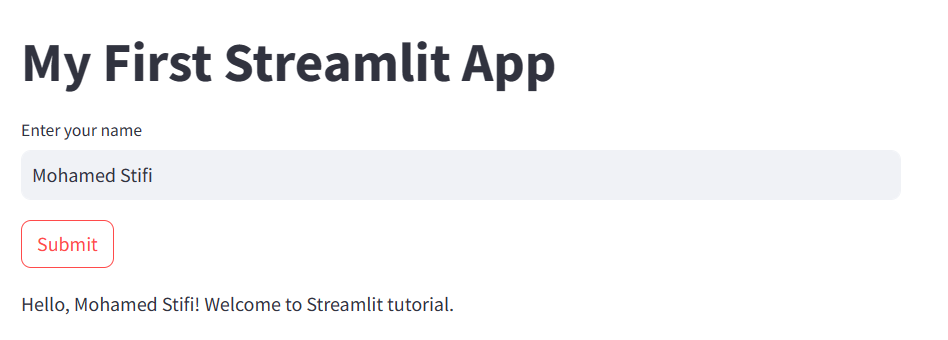

# Setting Up a Streamlit App

Setting up a Streamlit app is straightforward. Below are the steps to create a basic Streamlit app:

## 1. Install Streamlit
Make sure you have Streamlit installed in your Python environment. You can install it via pip:

```bash
pip install streamlit
```

## 2. Create Your App File
Create a new Python file (e.g., `app.py`) where you will write your Streamlit app code.

## 3. Write Your App Code
Write the code for your Streamlit app in the `app.py` file. This code will define the layout, widgets, and functionality of your app.

```python
# app.py
import streamlit as st

# Page title
st.title('My First Streamlit App')

# Text input widget
name = st.text_input('Enter your name', 'Mohamed Stifi')

# Button widget
if st.button('Submit'):
    st.write('Hello, ' + name + '! Welcome to Streamlit tutorial.')
```

## 4. Run Your App
Open a terminal or command prompt, navigate to the directory containing your `app.py` file, and run the following command:

```bash
streamlit run app.py
```
Output:


This command will start the Streamlit server and run your app. You should see a local URL (usually http://localhost:8501) where you can view your app in your web browser.

## 5. Edit and Iterate
As you develop your app, you can save changes to your `app.py` file, and Streamlit will automatically reload the app in your browser. You can iterate on your app code, adding features, widgets, and visualizations until you're satisfied with the result.
