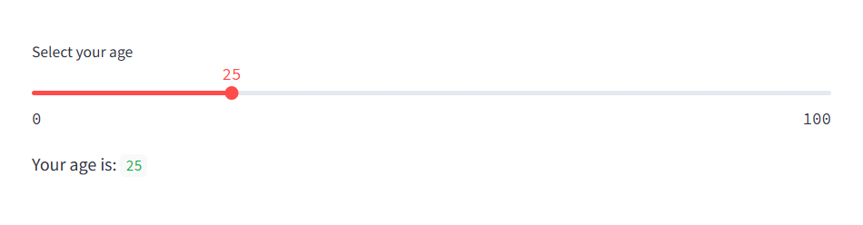
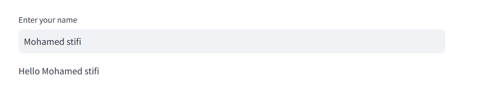
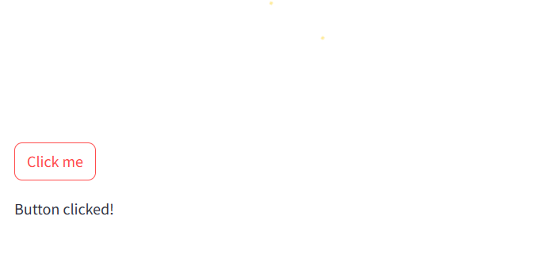
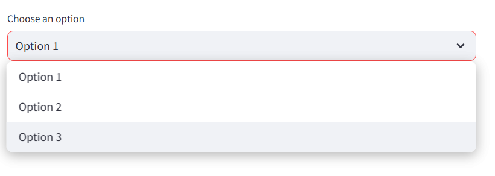
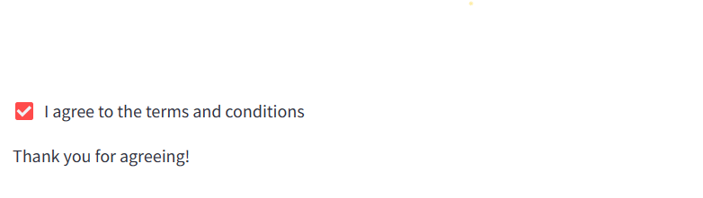
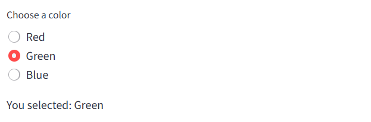
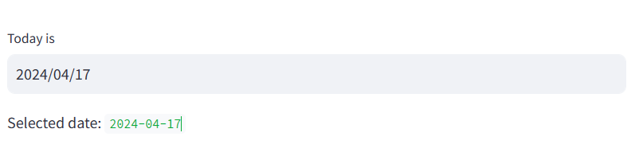
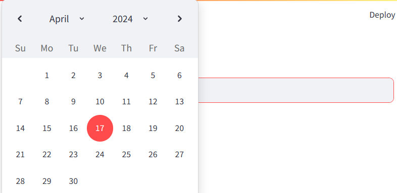
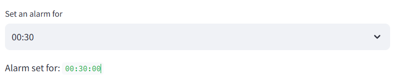

# Streamlit Widgets

here are code examples demonstrating the usage of different widgets provided by Streamlit:

## 1. Slider Widget
```python
import streamlit as st

# Slider widget
age = st.slider('Select your age', 0, 100, 25)
st.write('Your age is:', age)
```


## 2. Text Input Widget
```python
import streamlit as st

# Text input widget
name = st.text_input('Enter your name', 'John Doe')
st.write('Hello', name)
```



## 3. Button Widget
```python
import streamlit as st

# Button widget
if st.button('Click me'):
    st.write('Button clicked!')
```


## 4. Select Box Widget
```python
import streamlit as st

# Select box widget
option = st.selectbox('Choose an option', ['Option 1', 'Option 2', 'Option 3'])
st.write('You selected:', option)
```


## 5. Checkbox Widget
```python
import streamlit as st

# Checkbox widget
agree = st.checkbox('I agree to the terms and conditions')
if agree:
    st.write('Thank you for agreeing!')
```


## 6. Radio Button Widget
```python
import streamlit as st

# Radio button widget
color = st.radio('Choose a color', ['Red', 'Green', 'Blue'])
st.write('You selected:', color)
```


## 7. Date Input Widget
```python
import streamlit as st

# Date input widget
import datetime
today = st.date_input('Today is', datetime.date.today())
st.write('Selected date:', today)
```




## 8. Time Input Widget
```python
import streamlit as st

# Time input widget
import datetime
time = st.time_input('Set an alarm for', datetime.time(8, 30))
st.write('Alarm set for:', time)
```



These examples cover some of the commonly used widgets in Streamlit. You can find more information about other widgets and their customization options in the [Streamlit documentation](https://docs.streamlit.io/develop/api-reference/widgets).
